# Rapport Final
# Projet: Stocks Investhink
**Équipe :** Sergio Acosta / Seydina Mouhammad Sylla / Chatib Ismail  
**Date :** 2026-04-19
**Version :** v3.0

## Accèss au Tableau
https://trello.com/invite/b/69889d203acd92b9d2cb6acf/ATTI13fb0f74260717b76f93e96c900fda9a503A9DF0/stocks-investhink

---

# 1. Présentation du projet

## 1.1 Introduction

Le projet **Stocks Investhink** est une application web qui consiste à concevoir et développer un système logiciel complet qui permet d’analyser des données historiques des Actions (Stocks) de manière simple, claire et accessible.

L’application est réalisée avec **ASP.NET Core MVC** et il a été realisée en suivant ce qu'on a apris pendant le cours d'Implémentation d'un Sysème d'Information, avec les concepts en  Programation Orienté Objets, les patrons de conception, une organisation structurée du code, une séparation des responsabilités et les notions de réusinage.

---

## 1.2 Contexte du projet

Aujourd’hui, le trading est un domaine très populaire. Beaucoup de personnes veulent investir en bourse, mais elles rencontrent plusieurs problèmes :

- les outils existants sont souvent complexes 
- il y a beaucoup d'information sur les reseaux sociaux mais la fiabilité est bàs
- les interfaces sont difficiles à comprendre  
- les concepts techniques sont peu accessibles pour les débutants

Dans ce contexte, notre projet propose une solution plus simple.  L’objectif est de créer une application qui aide les utilisateurs à :

- comprendre les tendances du marché de stocks  
- visualiser les données de manière claire
- apprendre les bases de l’analyse technique à travers les indicateurs techniques  

Le projet a une dimension éducative. Il ne donne pas de conseils financiers réels, mais il permet de mieux comprendre le fonctionnement du marché.

---

## 1.3 Objectif général du système

L’objectif principal du système est de :

> Fournir une analyse simple et compréhensible des données historiques des actions.

Pour atteindre cet objectif, l’application permet de :

- importer des données de marché (fichiers CSV de Yahoo Finance)  
- analyser l’évolution des prix dans le temps  
- calculer des indicateurs techniques simples
- générer des signaux indicatifs (achat ou vente)  
- afficher les résultats de manière visuelle  

Le système vise à simplifier des concepts complexes pour les rendre accessibles aux utilisateurs débutants.

---

## 1.4 Description globale du produit

**Stocks Investhink** est une application web interactive accessible via un navigateur. 

L’utilisateur doit créer un compte et se connecter pour accéder aux fonctionnalités principales.

Une fois connecté, l’utilisateur peut :

1. importer un fichier CSV contenant des données boursières  
2. lancer une analyse des données  
3. visualiser les résultats de l’analyse  

L’application traite les données et produit des indicateurs techniques, des signaux d’achat ou de vente et une visualisation des tendances.

---

## 1.5 Fonctionnement général

Le fonctionnement global du système peut être résumé en plusieurs étapes simples :

### Étape 1 : Authentification
L’utilisateur crée un compte ou se connecte à l’application.

### Étape 2 : Importation des données
L’utilisateur importe un fichier CSV contenant les prix historiques d’une action.

### Étape 3 : Analyse
Le système analyse les données et calcule des indicateurs techniques.

### Étape 4 : Génération des résultats
Le système génère des signaux indicatifs et prépare les résultats.

### Étape 5 : Visualisation
Les résultats sont affichés dans une interface claire et lisible.

---

## 1.6 Fonctionnalités principales

Les principales fonctionnalités du système sont les suivantes :

### Gestion des utilisateurs
- création de compte  
- connexion et déconnexion  
- sécurisation des accès  

### Importation des données
- lecture de fichiers CSV  
- validation du format des données  
- gestion des erreurs  

### Analyse des données
- traitement des prix historiques  
- calcul des indicateurs techniques  

### Indicateurs techniques
- SMA (Simple Moving Average)  
- EMA (Exponential Moving Average)  
- RSI (Relative Strength Index)  

Ces indicateurs permettent de mieux comprendre les tendances du marché.

### Génération de signaux
Le système produit des signaux indicatifs :

- signal d’achat potentiel  
- signal de vente potentiel  

Ces signaux sont basés sur les indicateurs techniques.

### Visualisation des résultats
- affichage des données analysées  
- présentation claire des résultats  
- interface simple pour l’utilisateur  

---

## 1.7 Utilisateurs cibles

Le système est conçu principalement pour deux types d’utilisateurs :

### Utilisateur débutant
- ce qui souhaite apprendre le trading  
- ce qui a un peu de connaissances techniques  
- ce qui a besoin d’une interface simple  
- ce qui peut téléchargé de CSV de Yahoo Finance

### Développeur (hors système)
Responsable de la maintenance et de l’évolution de l’application

---
# 2. Explication des choix techniques

## 2.1 Choix du langage et du framework

Le projet a été développé avec **C# et ASP.NET Core MVC**.

Ce choix a été fait parce qu'il permet de créer facilement des applications web structurées et facilite l’organisation du code.

De plus, C# est le langage qu'on a utilisé le plus pendant tout nos parcour, ce qui nous fais sentir plus à l'aisse et permet de réduire les erreurs.

---

## 2.2 Choix de l’architecture MVC

Le projet utilise l’architecture **Model - View - Controller (MVC)**.

Ce choix permet de séparer les responsabilités :

- **Model** : représente les données  
- **View** : gère l’interface utilisateur  
- **Controller** : gère les interactions et les requêtes  

Cette séparation rend le code plus lisible, plus maintenable et c’est une architecture standard dans le développement web avec ASP.NET. 

En plus du MVC, on a crée un folder des services. Dans nos cas, ils contiennent la logique métier, par exemple :

- implementation de patrons Singleton, Facade et Commande
- traitement des fichiers CSV 
- calcul des indicateurs  
- génération des signaux  

Ce choix permet :

- d’éviter de mettre toute la logique dans les controllers  
- de rendre le code plus propre  
- de faciliter la réutilisation du code 

---

## 2.3 Choix de la base de données

Le projet utilise **SQLite** comme base de données.

Les raisons de ce choix sont :

- base de données légère et simple à utiliser  
- pas besoin d’installation complexe  
- bonne intégration avec **Entity Framework Core** alors on a crée le Context et après on a fait la migration. On peut la trouver dans le folder Migrations du projet. 

SQLite est suffisante pour stocker les utilisateurs et les données nécessaires au projet.

---

## 2.4 Utilisation d’Entity Framework Core

Le projet utilise **Entity Framework Core (EF Core)** pour gérer la base de données.

EF Core permet :

- de manipuler la base de données avec du code C#  
- d’éviter d’écrire du SQL directement  
- de simplifier les opérations CRUD (Create, Read, Update, Delete) 

Cela améliore la productivité et réduit les erreurs.

---

## 2.5 Gestion des données avec fichiers CSV

Le système utilise des fichiers **CSV** de Yahoo Finance pour importer les données boursières.

Ce choix est justifié par :

- simplicité du format 
- facilité de lecture et d’écriture  

Un service spécifique (`CsvImportService`) est utilisé pour lire et valider les données.

---

## 2.6 Choix des indicateurs techniques

Le projet utilise trois indicateurs :

- **SMA (Simple Moving Average)**  
- **EMA (Exponential Moving Average)**  
- **RSI (Relative Strength Index)**  

Ces indicateurs ont été choisis car ils sont simples à comprendre et ils sont très utilisés dans le trading. Cela permet aux utilisateurs débutants de mieux comprendre les tendances.

---

## 2.7 Gestion de l’authentification

Le système inclut un mécanisme d’authentification :

- inscription avec email et mot de passe  
- connexion utilisateur  
- protection des accès  

Les mots de passe sont stockés de manière sécurisée (hachage) pour sécuriser les données.  

---

## 2.8 Choix de l’interface utilisateur

L’interface est développée avec :

- Razor Views (.cshtml) 
- Bootstrap  
- CSS

On a ajouté Bootstrap parce qu'il permet un design responsive,  
une interface propre et c'est facile a implementer.

L’objectif est de garder une interface simple pour les utilisateurs débutants.

---

## 2.9 Gestion des erreurs

Le système inclut une gestion des erreurs :

- validation des fichiers CSV  
- gestion des erreurs d’entrée utilisateur  
- messages d’erreur clairs  

Cela améliore la robustesse du système et l’expérience utilisateur  

---

## 2.10 Choix de la simplicité

Une décision importante du projet est de garder le système simple.

Par exemple :

- pas de prédiction des prix  
- pas de trading réel  
- pas de fonctionnalités complexes  

Ce choix permet de se concentrer sur l’apprentissage, de réduire la complexité et de garantir un système stable.

---
# 3. Description de l’architecture

## 3.1 Vue générale de l’architecture

Notre projet est basé sur une architecture **MVC (Model - View - Controller)** plus une couche de Services.

Cette architecture permet de structurer le système de manière claire et de séparer les différentes responsabilités.

Le système est organisé en plusieurs parties principales :

- Controllers  
- Services  
- Models  
- Views  

Chaque partie a un rôle spécifique dans le fonctionnement de l’application.

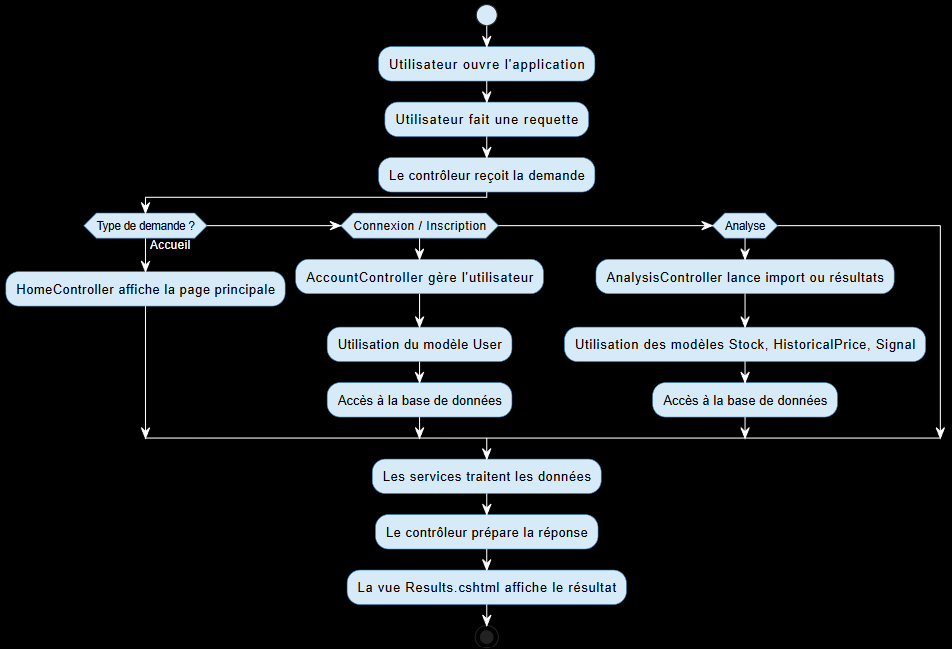

---

## 3.1.1 Controller

Les Controllers sont responsables de la gestion des requêtes utilisateur. Ils reçoivent les actions de l’utilisateur (ex : login, import CSV, analyse) et appellent les services nécessaires.

Exemples dans le projet :

- `AccountController`  
  - gère l’inscription et la connexion des utilisateurs  

- `AnalysisController`  
  - gère l’importation des données  
  - lance l’analyse  
  - prépare les résultats  

- `HomeController`  
  - gère les pages générales  

Les controllers ne contiennent pas de logique complexe. Ils servent principalement de lien entre l’interface et les services.

---

## 3.1.2 Couche Service (logique)

Les Services contiennent toute la logique complexe du système. Ils sont responsables de :

- traiter les données des utilisateurs et des Stocks
- effectuer les calculs pour les indicateurs et les signaux
- gérer les opérations principales 

Services principaux :

- `CsvImportService`  
  - lit et valide les fichiers CSV  

- `IndicatorService`  
  - calcule les indicateurs (SMA, EMA, RSI)  

- `SignalService`  
  - génère les signaux d’achat ou de vente  

- `DatabaseManager`  
  - gère l’accès à la base de données  

---

## 3.1.3 Model

Les Models représentent les données du système. Ils correspondent aux entités principales de l’application.

Exemples :

- `User`  
  - informations de l’utilisateur  

- `Stock`  
  - représente une action  

- `HistoricalPrice`  
  - contient les prix historiques  

- `IndicatorValue`  
  - représente les valeurs des indicateurs  

- `Signal`  
  - représente un signal généré  

Les modèles sont utilisés pour stocker les données dans la base de données et pour les manipuler dans le système.

---

## 3.1.4 Couche ViewModel

Le ViewModel est utilisé pour transférer les données entre les controllers et les vues. On à juste un:

- `AnalysisResultViewModel`

Il contient toutes les informations nécessaires pour afficher les résultats :

- données des prix  
- indicateurs  
- signaux  

Cela permet de regrouper les données, simplifier l’affichage et d'éviter de mélanger les modèles directement avec les vues  

---

## 3.1.5 View

Les Views représentent l’interface utilisateur.

Elles sont développées avec Html, Bootstrap, et CSS.  

Les vues principales sont :

- page d’accueil  
- page de connexion et inscription  
- page d’importation CSV  
- page des résultats  

Les vues affichent les données envoyées par les controllers.

---

## 3.2 Flux de fonctionnement global

Le fonctionnement du système suit un flux clair :

1. L’utilisateur envoie une requête (ex : importer un fichier)  
2. Le Controller reçoit la requête  
3. Le Controller appelle les Services  
4. Les Services traitent les données  
5. Les résultats sont envoyés au Controller  
6. Le Controller envoie les données
7. Le ModelView organize les résultats  
8. La View affiche les résultats  

---

## 3.3 Organisation du projet

Le projet est organisé en dossiers pour refléter l’architecture :

- `/Controllers`  
- `/Services`  
- `/Models`  
- `/ViewModels`  
- `/Views`  
- `/Data`

Cette organisation permet une navigation facile dans le code et une meilleure lisibilité.

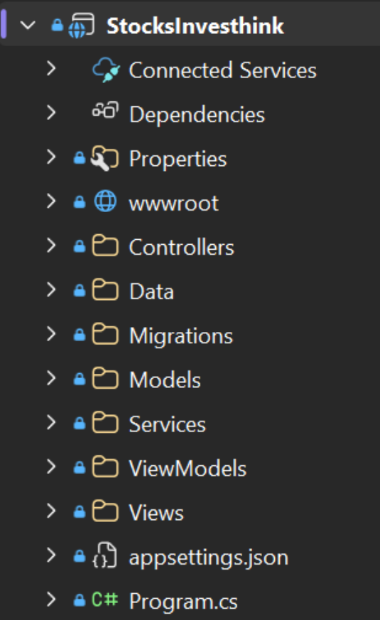

---

## 3.4 Gestion de la base de données

La base de données est intégrée dans l’architecture via Entity Framework.

On a utilisé un contexte de base de données (DbContext), des entités (Models) 
et des migrations dans le folder Data.  

---
# 4. Diagrammes UML

## 4.1 Introduction

Dans cette section, nous présentons les principaux diagrammes UML du projet.  
Ces diagrammes permettent de visualiser la structure du système et son fonctionnement.

Les diagrammes ont été réalisés avec **Draw.io**.

---

## 4.2 Diagramme de cas d’utilisation Haut niveau

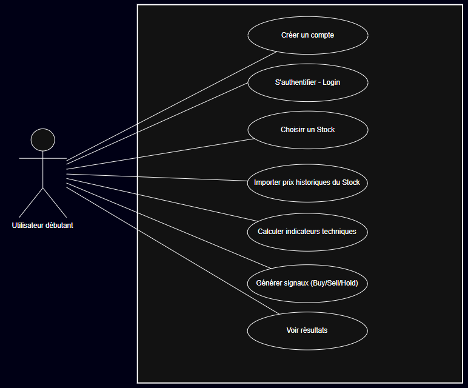

Le diagramme de cas d’utilisation montre les interactions entre l’utilisateur et le système.

Acteur principal :
- Utilisateur authentifié  

Fonctionnalités principales :

- consulter liste des Stocks 
- importer un fichier CSV  
- lancer une analyse  
- calculer indicateurs techniques
- générer des signaux indicatifs
- visualiser les résultats

Ce diagramme montre que le système est centré sur l’utilisateur.  
Toutes les fonctionnalités principales sont accessibles après authentification.

---

## 4.3 Diagramme de classes

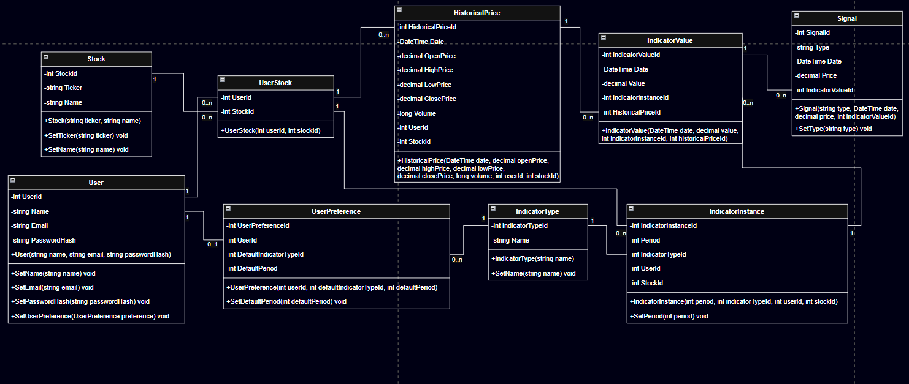

Le diagramme de classes représente la structure du système.

Classes principales :

- `User`  
- `Stock`  
- `HistoricalPrice`  
- `IndicatorValue`  
- `Signal`  

Relations principales:

- un **User** peut analyser plusieurs **Stocks**
- un **Stock** peut être analysé par plusieurs **Users**
- un **Stock** contient plusieurs **HistoricalPrice**  
- un **IndicatorValue** est lié à des **HistoricalPrice**  
- un **Signal** est basé sur un **IndicatorValue**

Ce diagramme montre une bonne organisation des données, une séparation claire des responsabilités et une structure adaptée à l’analyse boursière.

---

## 4.4 Diagramme entité-relation (ERD)

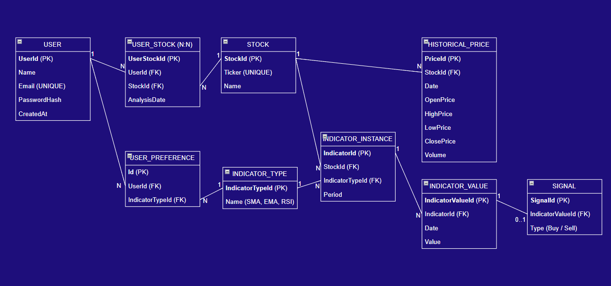

Ce diagramme représente la structure de la base de données.

Entités principales :

- User  
- Stock  
- HistoricalPrice  
- IndicatorValue  
- Signal  

Relations principales:

- un **User** peut analyser plusieurs **Stocks**
- un **Stock** peut être analysé par plusieurs **Users**
- un **Stock** contient plusieurs **HistoricalPrice**  
- un **IndicatorValue** est lié à des **HistoricalPrice**  
- un **Signal** est basé sur un **IndicatorValue**

---

## 4.5 Diagramme de composants

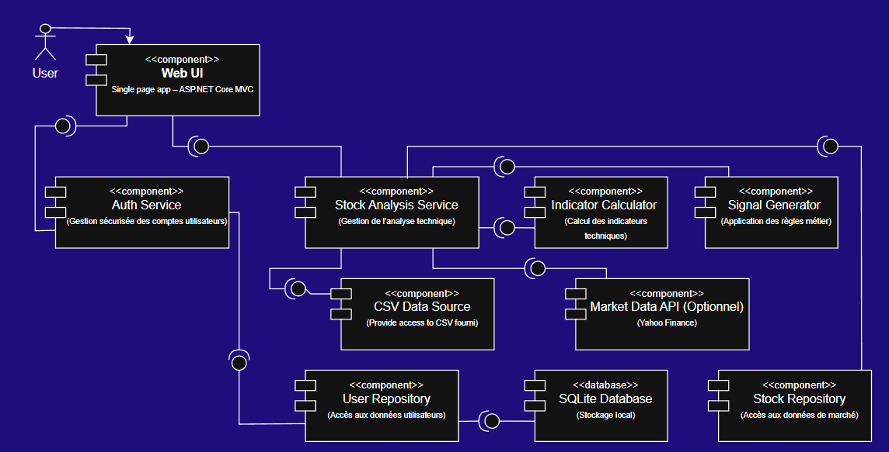

Le diagramme de composants montre les différentes parties du système et leurs interactions.

Composants principaux :

- Web UI
- Auth Service
- Stock Analysis Service
- User Repository
- SQLite Database  
- Stock Repository
- Indicator Calculator
- Signal Generator 

Ce diagramme permet de voir l’architecture globale du système et la communication entre les composants.

---

# 5. Patrons de Conception

## 5.1 Introduction

Dans notre projet, trois patrons de conception ont été implémentés de manière concrète dans le code :

- Singleton  
- Facade  
- Commande

---

## 5.2 Patron Singleton

Le patron Singleton garantit qu’une seule instance d’une classe general existe dans toute l’application. Dans notre projet, on l'a utilisé pour l'implementation de la base de données.

---

### 5.2.1 Implémentation

- Interface : `IDatabaseManager`  
- Classe concrète : `DatabaseManager`  

#### IDatabaseManager
- définit le contrat d’accès à la base de données  
- permet d’abstraire l’implémentation  

#### DatabaseManager
- implémente `IDatabaseManager`  
- contient l’instance unique (Singleton)  
- gère l’accès à la base de données  

---

### 5.2.2 Fonctionnement

La classe contient une instance statique privée qui contrôle la création de l’objet et qui retourne toujours la même instance. 

---

### 5.2.3 Avantages dans le projet

- une seule instance de la base de données  
- accès centralisé  
- possibilité de remplacer l’implémentation grâce à l’interface  

---

## 5.3 Patron Facade

Le patron Facade simplifie l’accès à un système complexe en offrant une interface unique à l'utilisateur.

---

### 5.3.1 Implémentation

- Interface : `IStockAnalysisFacade`  
- Classe concrète : `StockAnalysisFacade`  

#### IStockAnalysisFacade
- définit une méthode unique pour exécuter une analyse complète  
- permet au controller d’appeler une seule opération  

#### StockAnalysisFacade
- implémente l’interface IStockAnalysisFacade  
- orchestre le processus complet d’analyse  
- crée et configure les commandes suivantes :
  - ClearAnalysisDataCommand  
  - ImportHistoricalPricesCommand  
  - RunIndicatorsAndSignalsCommand  
- utilise AnalysisCommandInvoker pour exécuter les commandes dans l’ordre  
- gère une transaction pour garantir la cohérence des données  

Le controller n’interagit qu’avec la façade, sans connaître les détails internes du traitement. 

---

### 5.3.2 Fonctionnement

Le controller appelle uniquement la façade :

Controller → IStockAnalysisFacade → StockAnalysisFacade

La façade se charge de :

- importer les données  
- lancer les commandes  
- coordonner les services  

---

#### Relations

`StockAnalysisFacade` utilise :

- `AnalysisCommandInvoker`  
- les classes de commandes  
- les services (CsvImportService, IndicatorService, SignalService)  

---

### 5.3.3 Avantages dans le projet

- facilite la vie a l'utilisateur
- simplifie le code des controllers  
- centralise la logique du processus

---

## 5.4 Patron Commande

Le patron Commande permet de faire chaque action dans une classe indépendante, ceux qui permettre a l'utilisateur de retourner a une état précedent si besoin. Dans le cas de nos projet on l'utilise especifiquement pour pouvoir efacer les données historiques existants dans la base de données et importer de nouveau les prices historiques du même stock pour le même utilisateur.

---

### 5.4.1 Implémentation

- Interface : `ICommand`  
- Classes concrètes :
  - `ImportHistoricalPricesCommand`  
  - `ClearAnalysisDataCommand`  
  - `RunIndicatorsAndSignalsCommand`  
- Invoker :
  - `AnalysisCommandInvoker`  

#### `ICommand`
- définit la méthode `Execute()`  
- permet d’unifier toutes les commandes  

---

#### Commandes concrètes

##### `ImportHistoricalPricesCommand`
- utilise `CsvImportService` pour l'importation
- importe et valide les données CSV  

##### `ClearAnalysisDataCommand`
- supprime les anciennes données  
- prépare une nouvelle analyse  

##### `RunIndicatorsAndSignalsCommand`
- utilise `IndicatorService` pour calculer les indicateurs
- utilise `SignalService` pour génèrer les signaux  

---

#### `AnalysisCommandInvoker`
- exécute les commandes  
- contrôle l’ordre d’exécution  
- permet de chaîner les opérations  

---

### 5.4.2 Fonctionnement

Le fonctionnement du patron Commande dans ce projet repose sur une exécution séquentielle de plusieurs commandes, chacune représentant une étape spécifique du processus d’analyse.

Le flux général est le suivant :

Invoker → IAnalysisCommand → Commande specifique → Services → Base de données

L’interface `IAnalysisCommand` définit une méthode unique `ExecuteAsync()` que toutes les commandes doivent implémenter.

La classe `AnalysisCommandInvoker` est responsable de gérer et d’exécuter tous les commandes specifiques. Alors, elle stocke les commandes dans une liste, après elle permet d’ajouter des commandes avec `AddCommand()` et finalement elle exécute toutes les commandes dans l’ordre avec `ExecuteAllAsync()`.

Chaque commande encapsule une étape du processus :

1. `ClearAnalysisDataCommand`  
   - accède directement à la base de données via `StocksInvesthinkContext`  
   - supprime les anciennes données liées au user et au stock (signaux, valeurs d’indicateurs, instances d’indicateurs et prix historiques)  
   - garantit que l’analyse commence avec des données propres  

2. `ImportHistoricalPricesCommand`  
   - utilise `CsvImportService` pour importer les données depuis un fichier CSV  
   - enregistre les nouveaux prix historiques dans la base de données  
   - stocke le nombre de lignes importées dans `ImportedRows`  

3. `RunIndicatorsAndSignalsCommand`  
   - utilise `IndicatorService` et `SignalService` 
   - calcule les indicateurs techniques (SMA, EMA, RSI)
   - génère les signaux associés à chaque indicateur  

L’exécution suit donc un ordre logique :

1. nettoyage des anciennes données  
2. importation des nouvelles données  
3. calcul des indicateurs et génération des signaux 

Ce mécanisme permet :

- l'implementation facile des fonctionnalités futures. Par exemple, si l'utilisateur veut eliminer les anciennes données d'un Stock analisé
- une exécution contrôlée et séquentielle des étapes  
- une structure modulaire où chaque étape est indépendante 

---

### Avantages dans le projet

- retourné à l'étape précédent
- séparation claire des étapes  
- facile d’ajouter une nouvelle commande  

---

# 6. Développement des tests

Des tests unitaires ont été développés afin de valider principalement le bon fonctionnement de la gestion des utilisateurs et l’authentification.

Les tests utilisent une base de données en mémoire pour simuler le comportement réel sans affecter la base de données principale. Le framework utilisé est **NUnit** et ils sont regroupés dans :

- projet : `NUTest`  
- fichier : `UnitTest1.cs`  

avec la structure suivante, commen on a apris pendant le cours :

- Arrange  
- Act  
- Assert  

À continuation on décrit les Tests implémentés:

## 6.1 Test de création d’utilisateur

Ce test vérifie que la création d’un utilisateur fonctionne correctement.

Arrange:
- on cree une base de données en mémoire pour simuler le comportement réel sans affecter la base de données principale
- un utilisateur est ajouté dans une base de données en mémoire  

Act:
- les données sont sauvegardées  
- une requête est effectuée pour récupérer l’utilisateur  

Asset :
- l’utilisateur existe dans la base de données  
- l’email correspond à celui attendu  

---

## 6.2 Test de hash du mot de passe

Ce test vérifie la cohérence de la méthode de hash utilisée dans `AccountController`.

Arrange:
- un password est crée 

Act:
- le même password est hashé deux fois  

Asset :
- les deux résultats doivent être identiques  

---

## 6.3 Test d’authentification utilisateur

Ce test valide le processus d’authentification.

Arrange:
- on cree une base de données en mémoire pour simuler le comportement réel sans affecter la base de données principale
- un utilisateur est créé avec un mot de passe ha shé  
- il est enregistré dans la base de données en mémoire  

Act:
- une vérification est faite avec les mêmes identifiants  

Asset :
- le système reconnaît correctement l’utilisateur  

---
# 7. Execution du Projet

Cette section présente des captures d’écran de l’application en cours d’exécution. Elles permettent d’illustrer les principales fonctionnalités du système et le parcours utilisateur.

# 7.1 Page d'Accueil (Home)

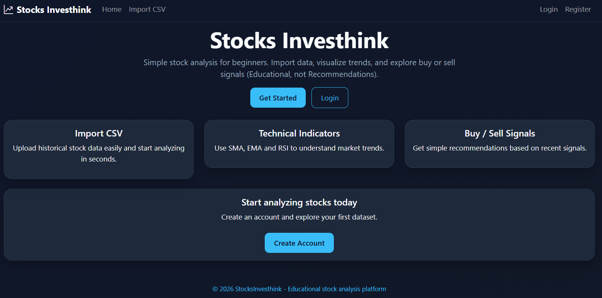

La page d’accueil est le point d’entrée de l’application et on l'a fait volontairement simple pour faciliter l’accès aux utilisateurs débutants. Elle présente :

- une introduction simple au système  
- des options pour se connecter ou créer un compte   

---

## 7.2 Création d’utilisateur (Register)

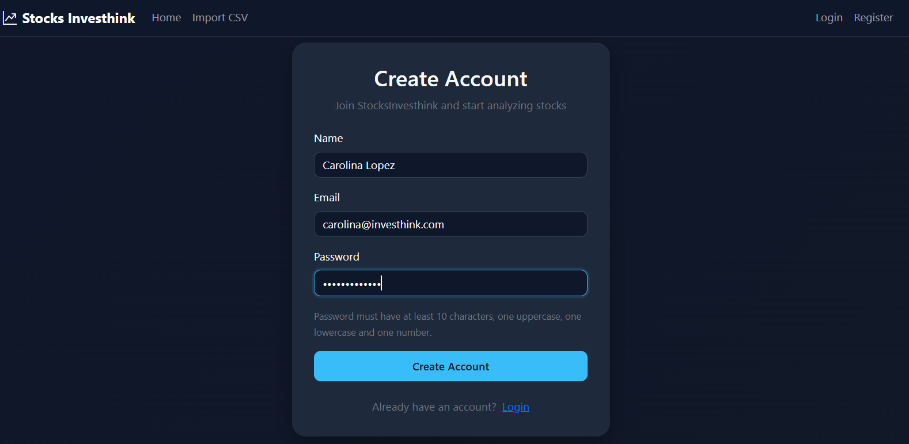

Cette page permet à un nouvel utilisateur de créer un compte. L’utilisateur doit :

- entrer son nom
- entrer son email  
- choisir un mot de passe en suivant les instructions  

Le système valide les informations avant de créer le compte.  
Cette étape est nécessaire pour accéder aux fonctionnalités de l’application.

---

## 7.3 Connexion (Login)

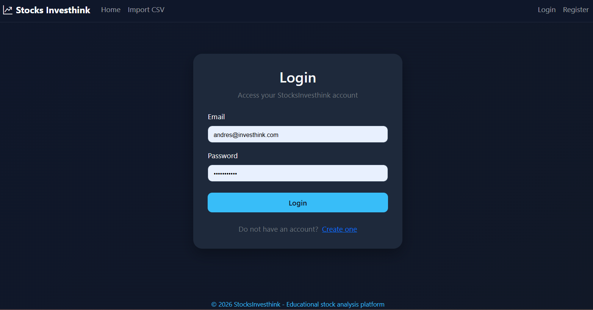

La page de connexion permet à l’utilisateur d’accéder à son compte.

Après authentification l’utilisateur peut accéder aux fonctionnalités principales.  

---

## 7.4 Importation du fichier CSV

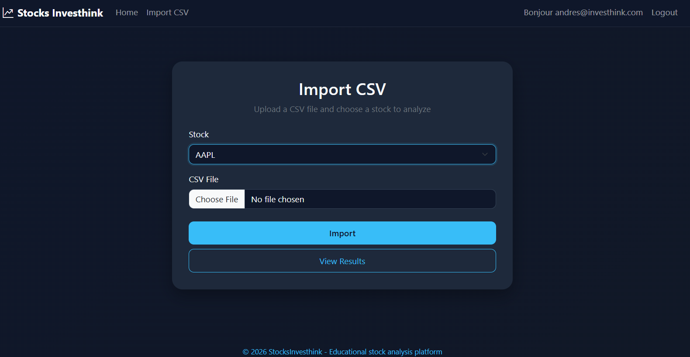

Cette page permet à l’utilisateur d’importer un fichier CSV contenant les données boursières.

Fonctionnalités principales :

- sélection du stock
- sélection du fichier  
- Le système valide le format  

Une fois le fichier importé, l’analyse peut être lancée.

---

## 7.5 Résultats et graphiques

Cette page affiche les résultats de l’analyse.

Elle présente :

- Les données génerales:
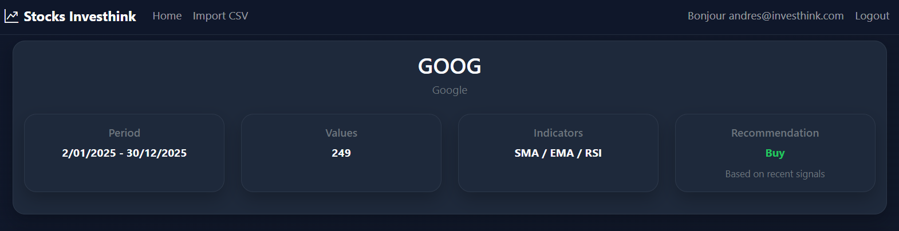
  - La période de dates évaluée
  - La quantité de valeurs
  - Les types d'Indicateurs évalués
  - Une recommendation finale

- Graphique de données historique VS Indicateur SMA et ses respectives signaux d'achat et vente génerées.
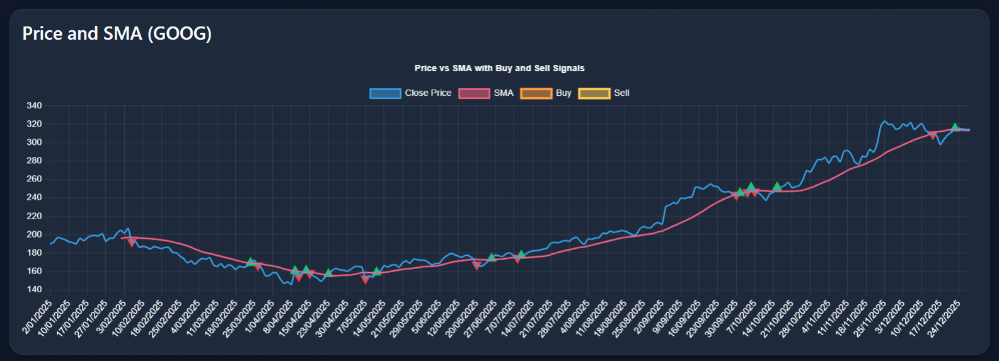

- Graphique de données historique VS Indicateur EMA et ses respectives signaux d'achat et vente génerées.
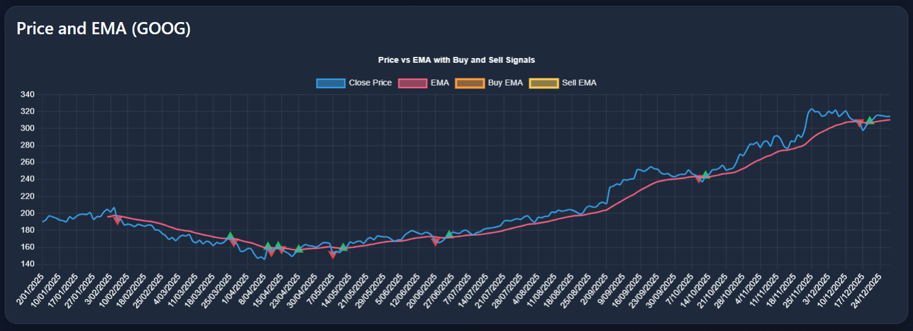

- Graphique de données historique VS Indicateur RSI et ses respectives signaux d'achat et vente génerées.
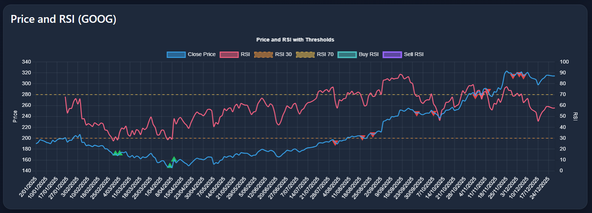

Les graphiques permettent de visualiser les tendances de manière claire et intuitive.

---

## 8. Annexe - User Stories Principales

On a ajoute les user stories suivants pertinentes dans Trello pour faire la gestion correspondant:

# US1 - Inscription utilisateur
En tant qu’utilisateur, je veux créer un compte avec un email et un mot de passe, afin d’accéder de manière sécurisée aux fonctionnalités de l’application.

Critères d’acceptation :
- L’utilisateur peut créer un compte avec un email valide.
- L’email doit être unique.
- Si l’email existe déjà, un message “Email déjà utilisé” est affiché.
- Le mot de passe est stocké de manière sécurisée (haché).
- Un message confirme la création du compte.
- En cas d’erreur, un message clair est affiché.
- Après inscription, l’utilisateur est redirigé vers la page Login.

Definition of Done (DoD):
- Fonctionnalité implémentée.
- Aucun bug bloquant.
- Testée manuellement (Tester : succès / email déjà utilisé / champs invalides)
- Code poussé sur GitHub

# US2 – Connexion et déconnexion
En tant qu’utilisateur, je veux me connecter et me déconnecter pour sécuriser mon compte.

Critères d’acceptation :
- Session valide après login
- Logout fonctionne
- Accès aux fonctionnalités limité pour les non-connectés

Definition of Done (DoD):
- Fonctionnalité implémentée.
- Aucun bug bloquant.
- Testée manuellement
- Code poussé sur GitHub

# US3 – Importer fichier CSV
En tant qu’utilisateur connecté, je veux importer un fichier CSV pour analyser les données.

Critères d’acceptation :
- Fichier valide
- Erreurs détectées et affichées
- Confirmation après import

Definition of Done (DoD):
- Fonctionnalité implémentée.
- Aucun bug bloquant.
- Testée manuellement
- Code poussé sur GitHub

# US4 – Calculer indicateurs techniques
En tant qu’utilisateur, je veux calculer SMA, EMA et RSI pour voir les tendances.

Critères d’acceptation :
- Calcul correct du SMA, EMA, RSI standard
- Temps < 2 secondes pour CSV standard

Definition of Done (DoD):
- Fonctionnalité implémentée.
- Aucun bug bloquant.
- Testée manuellement
- Tests unitaires de base pour le SMA.
- Code poussé sur GitHub

# US5 – Générer signaux indicatifs
En tant qu’utilisateur, je veux recevoir des signaux indicatifs d’achat/vente pour illustrer les tendances.

Critères d’acceptation :
- Signaux corrects selon les indicateurs
- Signaux associés au bon indicateur

Definition of Done (DoD):
- Fonctionnalité implémentée.
- Aucun bug bloquant.
- Testée manuellement
- Code poussé sur GitHub

# US6 – Graphiques
En tant qu’utilisateur, je veux voir des graphiques pour interpréter facilement les données.

Critères d’acceptation :
- Graphiques clairs et lisibles
- Graphique individuelle pour chaque indicateur
- Légende et couleurs correctes

Definition of Done (DoD):
- Fonctionnalité implémentée.
- Aucun bug bloquant.
- Testée manuellement
- Code poussé sur GitHub